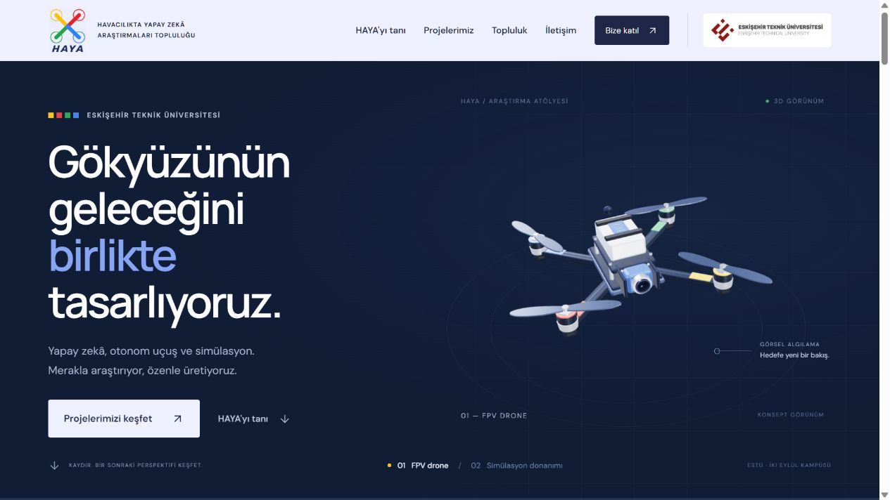
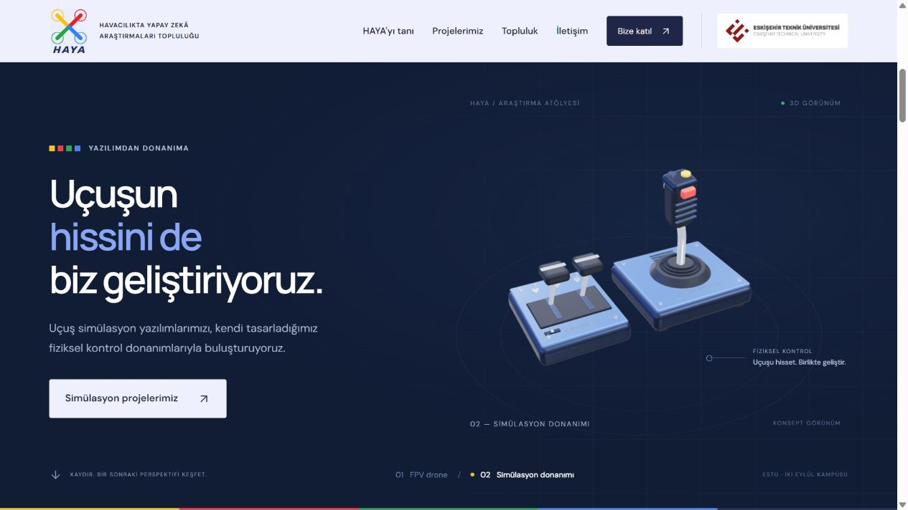
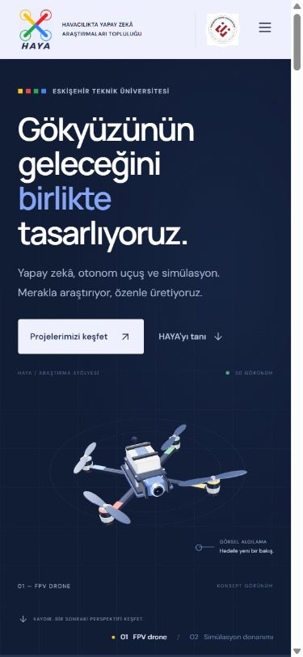

<p align="center">
  
</p>

<h1 align="center">HAYA Web</h1>

<p align="center">
  Eskişehir Teknik Üniversitesi<br>
  Havacılıkta Yapay Zekâ Araştırmaları Topluluğu
</p>

<p align="center"><strong>Gökyüzünün geleceğini birlikte tasarlıyoruz.</strong></p>

HAYA'nın araştırma alanlarını, uçuş simülasyon yazılımlarını ve donanımlarını, otonom uçuş çalışmalarını ve topluluk faaliyetlerini tanıtan web sitesi. Kaydırma hareketiyle FPV drone'dan uçuş simülasyonu kumandalarına geçen bir 3D sahne içerir.



## Özellikler

- Three.js ile yerel olarak modellenmiş FPV drone ve uçuş kontrol donanımı.
- Kaydırma ve sahne seçimiyle değişen 3D anlatım; işaretçi hareketine tepki veren modeller.
- Masaüstü ve mobil ekranlara uyumlu tasarım, mobil menü ve araştırma ayrıntı pencereleri.
- TEKNOFEST FPV Drone İzleme (Tracking), 2209-A, 2209-B, LİFT-UP ve 2242 proje içerikleri.
- Güncel danışman, sorumlu ve kampüs iletişim bilgileri.
- Sonradan eklenecek Google Forms bağlantısı için tek dosyadan yapılandırma.
- Azaltılmış hareket tercihi, klavye ile gezinme ve WebGL kullanılamadığında alternatif görünüm.

3D modeller kavramsal tanıtım görselleridir; tamamlanmış ürünlerin CAD modelleri değildir.

## Teknolojiler

| Katman | Teknoloji |
| --- | --- |
| Uygulama | TypeScript, HTML, CSS |
| Geliştirme ve derleme | Vite 7 |
| 3D sahne | Three.js |
| İkonlar | Lucide |
| Yazı tipleri | DM Sans, Manrope |

Uygulama statik bir web sitesidir. Üyelik başvuruları, bağlantı eklendiğinde Google Forms üzerinden alınır.

## Yerelde çalıştırma

Node.js **22.12 veya üzeri** ve npm gerekir. `.nvmrc` dosyası Node.js 24'ü seçer.

```sh
git clone https://github.com/erenefe0/HAYA-WEB.git
cd HAYA-WEB
npm ci
npm run dev
```

Geliştirme adresi: [http://127.0.0.1:5173](http://127.0.0.1:5173). Port kullanımdaysa Vite çıktısındaki adresi kullanın.

| Komut | İşlev |
| --- | --- |
| `npm ci` | Kilit dosyasındaki bağımlılıkları kurar. |
| `npm run dev` | Yerel geliştirme sunucusunu başlatır. |
| `npm run build` | TypeScript kontrolünü çalıştırır ve `dist/` çıktısını üretir. |
| `npm run format` | Kaynak kodunu tutarlı biçimde düzenler. |
| `npm run format:check` | Kod biçimini değişiklik yapmadan denetler. |
| `npm run preview` | Derlenmiş siteyi yerelde önizler. |

## Google Forms katılım bağlantısı

[src/site-config.ts](src/site-config.ts) dosyasındaki `joinFormUrl` alanını doldurun:

```ts
export const siteConfig = {
  joinFormUrl: 'https://forms.gle/YOUR_FORM_ID',
};
```

`https://forms.gle/...` ve `https://docs.google.com/forms/...` biçimleri desteklenir. Geçerli bağlantı eklendiğinde katılım çağrıları formu yeni sekmede açar. Alan boşken bağlantılar katılım bölümüne gider ve başvuru butonunda **“Katılım formu yakında”** gösterilir.

İçerik, logo ve form yapılandırması için [yapılandırma rehberine](docs/CONFIGURATION.md) bakın.

## Proje yapısı

```text
HAYA-WEB/
├── .github/              # Issue ve pull request şablonları
├── docs/
│   ├── branding/         # Marka kaynakları ve logo kullanım bilgileri
│   └── screenshots/      # Masaüstü ve mobil önizlemeler
├── public/               # Site logoları ve favicon
├── src/
│   ├── main.ts           # Uygulamayı başlatır
│   ├── content.ts        # Araştırma ve proje verileri
│   ├── page.ts           # Sayfa HTML şablonu
│   ├── ui.ts             # Ortak HTML ve katılım yardımcıları
│   ├── interactions.ts   # Menü, pencereler ve hareket tercihi
│   ├── flight-story.ts   # Kaydırma ve sahne seçimi
│   ├── models/           # Drone, kumandalar ve ortak 3D yardımcıları
│   ├── scene.ts          # Kamera, çizim ve sahne yaşam döngüsü
│   ├── site-config.ts    # Google Forms bağlantısı
│   └── style.css         # Tasarım ve responsive yerleşim
├── index.html
├── package.json
├── package-lock.json
└── tsconfig.json
```

## Önizlemeler

| Simülasyon donanımı | Mobil görünüm |
| --- | --- |
|  |  |

## Geliştirme ve yayınlama

Başlangıç noktası `src/main.ts` dosyasıdır. Kart metinleri `src/content.ts`, sayfa bölümleri `src/page.ts`, etkileşimler `src/interactions.ts` içindedir. Kaydırma ve 3D model kodları ayrı modüllerdedir; kaynaklarda Türkçe açıklamalar bulunur.

| Rehber | İçerik |
| --- | --- |
| [Geliştirici rehberi](docs/DEVELOPMENT.md) | Modül mimarisi, başlatma sırası, kaydırma hesabı, 3D koordinatlar, kaynak temizliği, test senaryoları, sorun giderme ve Git akışı. |
| [Yapılandırma](docs/CONFIGURATION.md) | Google Forms, kartlar, tanıtım metinleri ve görseller. |
| [Katkı rehberi](CONTRIBUTING.md) | Dal, PR, kod biçimi ve kontrol beklentileri. |
| [Varlık rehberi](docs/ASSETS.md) | Logo, poster ve marka kaynakları. |

Geliştirme akışı, 3D sahnenin davranışı ve manuel kontroller [geliştirici rehberinde](docs/DEVELOPMENT.md) açıklanır. Değişiklik önerileri için [katkı rehberini](CONTRIBUTING.md) kullanın.

`npm run build` sonrası oluşan `dist/` klasörü statik bir sunucuda yayımlanabilir. Varsayılan varlık yolları alan adının kök dizini için hazırlanmıştır. GitHub Pages gibi `/HAYA-WEB/` alt yolunda yayınlama için Vite `base` ayarı ve kökten başlayan görsel yolları birlikte düzenlenmelidir. Ayrıntılar [yayınlama notlarında](docs/DEVELOPMENT.md#yayınlama) bulunur.

## İçerik ve marka kaynakları

Proje kodları, ekip ve iletişim bilgileri HAYA'nın güncel tanıtım posterine dayanır. Yarışma açıklaması [resmî TEKNOFEST sayfasından](https://teknofest.org/tr/yarismalar/fpv-drone-izleme-tracking-yarismasi/) alınmıştır. “Hayâ” çağrışımı topluluğun marka anlatımında tevazu, özen ve saygı üzerinden işlenmiştir.

ESTÜ'nün resmî logoları üniversitenin kullanım kılavuzundan alınmış ve özgün renkleriyle korunmuştur. HAYA logosu ayrı bir topluluk kimliğidir. Kaynaklar ve görsellerin kullanımı [varlık rehberinde](docs/ASSETS.md) listelenir.

Bu depo için bir açık kaynak lisansı henüz belirlenmemiştir.

## Mevcut sınırlar

- Google Forms bağlantısı henüz doldurulmamıştır; başvurular bağlantı eklendiğinde açılır.
- 3D modeller tanıtım amaçlıdır; gerçek uçuş kontrolü veya uçuş simülasyonu bu web sitesinde çalıştırılmaz.
- Otomatik uçtan uca test paketi ve depo içi yayınlama workflow'u yoktur. Derleme ve biçim kontrolüne tarayıcı kontrolleri eşlik eder.
- WebGL kullanılamadığında alternatif görünüm gösterilir. Yazı tipleri Google Fonts üzerinden yüklenir.
