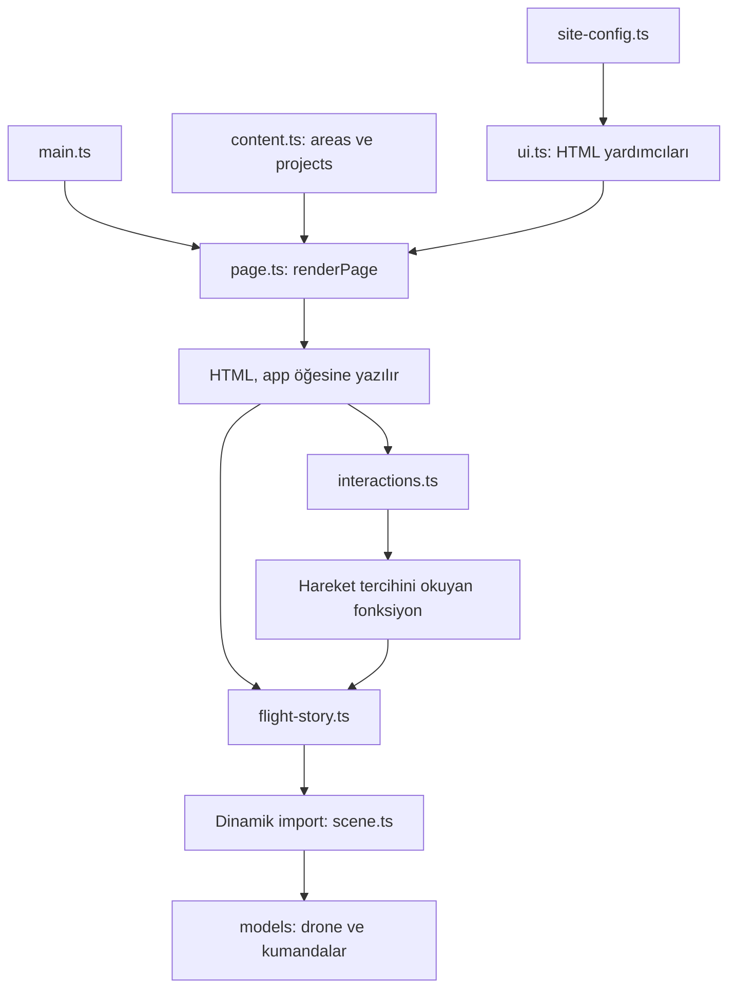

# Geliştirici rehberi

## Kurulum

Node.js 22.12 veya üzeri kullanın. `.nvmrc` Node.js 24'ü belirtir. Bağımlılık sürümlerini sabitleyen `package-lock.json` depoya dahildir.

```sh
npm ci
npm run dev
```

PowerShell `npm.ps1` çalıştırılmasını engelliyorsa aynı komutların `npm.cmd ci`, `npm.cmd run dev` ve `npm.cmd run build` biçimlerini kullanabilirsiniz.

Geliştirme sunucusu varsayılan olarak `127.0.0.1:5173` üzerinde çalışır. Belirli bir portu zorunlu tutmak için:

```sh
npm run dev -- --port 5173 --strictPort
```

## Uygulama akışı

`src/main.ts` yalnızca başlatma sırasını yönetir: sayfayı oluşturur, etkileşimleri bağlar ve kaydırma anlatımını başlatır. 3D sahne ayrı bir dinamik import ile yüklenir.

| Dosya | Sorumluluk |
| --- | --- |
| `src/content.ts` | Araştırma alanlarının ve proje kartlarının verileri. |
| `src/page.ts` | Sayfa bölümlerinin HTML şablonu ve tanıtım metinleri. |
| `src/ui.ts` | Ortak logo, ikon ve güvenli Google Forms bağlantısı yardımcıları. |
| `src/interactions.ts` | Mobil menü, araştırma penceresi, görünürlük ve hareket tercihi. |
| `src/flight-story.ts` | Kaydırma ilerlemesi, bölüm seçimi ve 3D sahnenin yüklenmesi. |
| `src/scene.ts` | Kamera, ışık, çizim döngüsü ve GPU kaynaklarının temizlenmesi. |
| `src/models/drone.ts` | FPV drone geometrisi ve pervaneler. |
| `src/models/controls.ts` | Kumanda kolu ve çift gaz kolu geometrisi. |
| `src/models/helpers.ts` | Model parçalarını oluşturmak için ortak yardımcılar. |
| `src/models/materials.ts` | Ortak renkler ve yüzey özellikleri. |

Modeller ve materyaller yereldir; uzaktan model dosyası indirilmez. Sahne yalnızca tanıtım için kavramsal bir görseldir. Kaynak kodundaki Türkçe yorumlar özellikle kararların nedenini ve değiştirirken dikkat edilecek noktaları açıklar.

## Modüller nasıl birlikte çalışır?



`renderPage()` HTML metnini döndürür; `main.ts` bunu `#app` içine yazar. `initializeInteractions()` olayları bağlar ve güncel hareket tercihini okuyan bir fonksiyon döndürür. `initializeFlightStory()` bu fonksiyonu sahneye aktarır. Böylece 3D sahne, kullanıcı tercihi değiştikten sonra güncel değeri her karede okuyabilir.

DOM sorgularındaki `!`, elemanın şablonda bulunduğu varsayımını TypeScript'e bildirir; çalışma zamanında kontrol yapmaz. Şablon oluşturulmadan etkileşimleri başlatmayın. Bir kimliği veya sınıfı değiştirirken ilgili DOM sorgularını da güncelleyin.

### İçerik, şablon ve ikonlar

`areas` kartların ve ayrıntı pencerelerinin ortak kaynağıdır. `no` değerleri benzersiz olmalı; karttaki `data-area` değeriyle eşleşmelidir. `projects` proje kartlarını oluşturur. TEKNOFEST, ekip ve diğer sabit metinler `page.ts` içindedir. İçerik değişikliklerinin dosya karşılıkları [yapılandırma rehberinde](CONFIGURATION.md) listelenir.

Yeni Lucide ikonu kullanırken `ui.ts` içindeki `icon()` yardımcısını çağırın; ikonu `interactions.ts` import listesine ve `refreshIcons()` haritasına da ekleyin. Ayrıntı penceresi dinamik oluşturulduğu için ikon dönüşümü açılışta tekrar çalışır.

HTML şablonları `innerHTML` ile oluşturulur. Mevcut veriler geliştiricinin depoda düzenlediği sabit metinlerdir. Kullanıcı girdisi veya uzak servisten gelen içerik doğrudan bu şablonlara eklenmemelidir. Böyle bir özellik geliştirilirse metinler için `textContent` veya güvenilir bir HTML temizleme katmanı kullanılmalıdır.

### Kullanıcı etkileşimleri

| Davranış | Nasıl çalışır? |
| --- | --- |
| Mobil menü | `hidden`, `aria-expanded` ve düğme açıklaması birlikte değişir. Bağlantı seçimi, Escape veya 1101 px ve üzeri ekran menüyü kapatır. |
| Bölüm animasyonu | `IntersectionObserver`, `.reveal` öğesinin yüzde 8'i görünür olunca `.visible` ekler ve gözlemlemeyi bırakır. |
| Ayrıntı penceresi | Yerleşik `<dialog>` kullanılır. Kapat düğmesi, Escape, dış alana tıklama veya katılım bağlantısı pencereyi kapatır. |
| Hareket tercihi | Sistem ayarıyla başlar; altbilgi düğmesi değiştirir. Tercih kalıcı depolamaya yazılmaz. |
| Katılım bağlantısı | `ui.ts` HTTPS Google Forms adresini doğrular; boş veya geçersiz adreste `#katil` kullanılır. |

### Kaydırma hesabı

```text
ilerleme = (scrollY - bölümün üst konumu + üst menü yüksekliği)
           / max(bölüm yüksekliği - sabit alan yüksekliği, 1)
```

`flight-story.ts` sonucu 0–1 aralığına sınırlar. Kaydırma olayları `requestAnimationFrame` ile birleştirilir; bir sonraki ekran karesinde tek hesaplama yapılır.

| Değer | İşlev |
| --- | --- |
| `0.53` | İkinci başlık, açıklama ve seçili düğme etkinleşir. |
| `0.40–0.64` | `scene.ts`, `smoothstep` ile drone'u küçültüp kumandaları büyütür. |
| `0` ve `0.8` | Model düğmeleri başlangıç ve donanım bölümüne kaydırır. |

Metin geçişi doğrudan kaydırma konumunu, 3D geçişi normal harekette yumuşatılmış konumu kullanır. Hızlı kaydırmada kısa gecikme görülebilir. Azaltılmış harekette yumuşatma, salınım, pervane dönüşü ve işaretçi etkisi kapatılır; kaydırmayla model seçimi korunur. Gizlenen metinlere `inert` ve `aria-hidden` uygulanır.

### 3D model geliştirme

`makeDrone()` drone grubunu ve döndürülecek pervane gruplarını (`props`) döndürür. `makeControls()` kumanda kolu ve çift gaz kolundan oluşan grubu döndürür. `scene.ts` bunları sahneye ekler; ölçek, dönüş ve görünürlüklerini yönetir.

X sağ/sol, Y yükseklik, Z ön/arka eksenidir; drone kamerası -Z yönüne bakar. Ölçüler yerel sahne birimidir. `box()` sırasıyla üst grup, genişlik, yükseklik, derinlik, materyal, X/Y/Z konumu ve köşe yarıçapı alır. `add()` geometriyi mesh'e dönüştürür; `screw()` vida, `textLabel()` canvas dokusundan yüzey yazısı oluşturur.

Renkler `models/materials.ts` içindedir. `metalness` metal görünümünü, `roughness` yüzey pürüzlülüğünü belirler. Materyaller ortak kullanıldığından tek değişiklik birden fazla parçayı etkileyebilir. Kamera ve ışıklar `scene.ts` içindedir. Geometri değişikliğinden sonra hem dar hem geniş ekran kadrajını inceleyin.

### CSS sırası ve erişilebilirlik

`style.css` tema değişkenleri, ortak öğeler, sayfa bölümleri ve ekran kırılımları sırasıyla düzenlenmiştir. Türkçe bölüm yorumları aradığınız kuralları bulmayı kolaylaştırır. `--header` menü yüksekliğini, `--gutter` yatay boşluğu belirler. Son kurallar önceki kuralları bilerek geçersiz kılar; kısa mobil ekran düzeltmelerinin sırasını koruyun.

Görünür odak çizgilerini, içeriğe geç bağlantısını, görsel açıklamalarını ve düğmelerin ARIA durumlarını koruyun. Metni görsel olarak gizlemek, klavye ve ekran okuyucu erişimini kendiliğinden kaldırmaz; bölüm geçişlerindeki `inert` kullanımı bu nedenle önemlidir.

### Sahne yaşam döngüsü

`ResizeObserver` boyut değişimlerini izler. `IntersectionObserver` ekran dışındaki, `visibilitychange` gizli sekmedeki çizimi durdurur. `dispose()` geometrileri, tekilleştirilmiş materyalleri, yazı dokularını, ortam dokusunu ve renderer'ı temizler. Yeni doku veya gözlemci eklediğinizde temizleme adımını da ekleyin.

Geliştirme sırasında sahne ve kaydırma dinleyicileri `import.meta.hot.dispose` ile temizlenir. Etkileşim modülünde tüm olaylar için tam HMR temizleme katmanı bulunmaz; menü veya pencere kodunu değiştirirken şüpheli davranışı tam sayfa yenilemesiyle tekrar kontrol edin.


## Kod biçimi

```sh
npm run format
npm run format:check
```

İlk komut kaynak kodunu Prettier ile düzenler; ikinci komut dosyaları değiştirmeden biçimi denetler. Biçim kuralları `.prettierrc.json` dosyasındadır. CSS kurallarının sırası korunmalıdır: dosyanın sonundaki mobil ve kısa ekran düzeltmeleri önceki kuralları tamamlar.

Kaydırma ilerlemesi iki sahne arasında geçiş sağlar. Kullanıcı sahne düğmeleriyle ilgili kaydırma noktasına gidebilir. İşaretçi hareketi küçük perspektif değişiklikleri oluşturur.

## Hareket ve performans

- Sahne ekran dışında veya sekme gizliyken çizim durur.
- Küçük ekranlarda kare hızı yaklaşık 30 FPS ile sınırlandırılır.
- Piksel oranı en fazla 1.75 olur.
- `prefers-reduced-motion` tercihi ve altbilgideki hareket kontrolü desteklenir.
- WebGL başlatılamadığında veya bağlam kaybolduğunda alternatif görünüm gösterilir.
- Sayfa kapanırken ve geliştirme modülünün yaşam döngüsü sonlanırken 3D kaynaklar temizlenir.

## Değişikliği doğrulama

```sh
npm run build
```

Bu komut TypeScript kontrolünü ve Vite üretim derlemesini çalıştırır. Derleme başarılı olsa da Three.js sahne paketi için boyut uyarısı görülebilir; sahne ana uygulamadan ayrı yüklenir.

Arayüz değişikliklerini tarayıcıda ilgili akışla inceleyin. Masaüstü ve mobil yerleşimlerde yatay taşma, sabit üst menü ve bölüm bağlantılarını kontrol edin. Etkilenen alanlara göre mobil menü, araştırma pencereleri, katılım formu yönlendirmesi, sahne seçimi ve azaltılmış hareket davranışını doğrulayın.

## Yayınlama

```sh
npm run build
npm run preview
```

`npm run preview`, üretilen `dist/` çıktısını yerelde sunar. Üretim ortamına `dist/` klasörünün içeriğini yükleyin. Uygulama için ayrı bir sunucu uygulaması veya veritabanı gerekmez.

### Kök dizin

Alan adı kökünde yayınlama mevcut yapılandırmayla desteklenir. `index.html`, üretilen `assets/` klasörü ve `public/` kaynaklarından kopyalanan logolar birlikte sunulmalıdır.

### Alt yol ve GitHub Pages

Bir proje sayfası `/HAYA-WEB/` altında sunulacaksa Vite'ın `base` ayarını bu yola göre yapılandırın. `src/page.ts`, `src/ui.ts` ve `index.html` içindeki `/haya-...`, `/estu-...` ve `/favicon.png` gibi kökten başlayan görsel yollarını da aynı tabana göre düzenleyin. Yalnızca `base` ayarını değiştirmek görsel yollarını düzeltmez.

Bu depoda otomatik yayınlama iş akışı tanımlanmamıştır. Statik barındırma seçildiğinde ilgili platformun yükleme adımları ayrıca yapılandırılabilir.

## Manuel kontrol senaryoları

Bu projede otomatik uçtan uca test paketi tanımlı değildir. `npm run format:check` kod biçimini, `npm run build` tipleri ve paketlemeyi kontrol eder. Kullanıcı akışları ayrıca tarayıcıda denenmelidir.

| Kontrol | İşlem | Beklenen sonuç |
| --- | --- | --- |
| Masaüstü | Yaklaşık 1280 px genişlikte açın. | Logolar, başlık ve drone görünür; yatay taşma olmaz. |
| Mobil menü | 390 px genişlikte menüyü açıp bölüm seçin. | Menü açılır, doğru bölüme gidilir ve menü kapanır. |
| Araştırma | Kartları açın; düğme ve Escape ile kapatın. | Doğru ayrıntı görünür; kapanınca sayfa kaydırması geri gelir. |
| Model seçimi | Donanım ve drone düğmelerini seçin. | Metin, seçili düğme ve 3D model uyumlu değişir. |
| Hareket | Hareketi azalt düğmesini kullanın. | Düğme durumu değişir; salınım ve pervane dönüşü durur. |
| Boş form | `joinFormUrl` boşken katılım çağrılarını deneyin. | Katılım bölümüne gidilir; başvuru düğmesi beklemededir. |
| Geçerli form | Size ait geçerli form adresini yapılandırın. | Menü, topluluk ve pencere çağrıları formu yeni sekmede açar. |
| Kısa ekran | 390 × 700 boyutunu inceleyin. | Başlık, sahne ve model düğmeleri kullanılabilir kalır. |

PR açıklamasında gerçekten çalıştırdığınız kontrolleri belirtin. Bu tablo bir kontrol planıdır; her satırın her değişiklikte çalıştırıldığı anlamına gelmez.

### 3D durumunu inceleme

Geliştirici araçlarında `#flight-canvas` öğesini inceleyin:

| Öznitelik | Anlam |
| --- | --- |
| `data-scene-ready` | En az bir çizim yapıldığında `true`. |
| `data-flight-progress` | Sahnenin kullandığı 0–1 ilerleme değeri. |
| `data-model` | Baskın model: `drone` veya `controls`. |
| `data-motion-reduced` | Sahnenin okuduğu hareket tercihi. |

Bunlar gözlem içindir; değerlerini değiştirerek sahne kontrol edilmez.

## Sorun giderme

| Belirti | Kontrol / çözüm |
| --- | --- |
| `npm.ps1` engelleniyor | Windows'ta `npm.cmd` kullanın. |
| Port kullanılıyor | Terminalde verilen adrese gidin veya `--port 5174 --strictPort` kullanın. |
| Node sürümü hatası | `.nvmrc` ile uyumlu Node 24 kullanın; `npm ci` çalıştırın. |
| İkon görünmüyor | İkon adını, importu ve `refreshIcons()` haritasını kontrol edin. |
| Form açılmıyor | HTTPS adresini, desteklenen alan adını ve `site-config.ts` değerini kontrol edin. |
| 3D yerine logo var | Konsolda import/WebGL hatasına, tarayıcı desteğine ve donanım hızlandırmasına bakın. |
| CSS değişikliği görünmüyor | Sınıf adını ve sonraki medya kurallarını karşılaştırın. |
| Büyük paket uyarısı | 3D paketi 500 kB eşiğini aşabilir; uyarı hata değildir, sahne ayrı yüklenir. |
| Yayında görseller eksik | Kökten başlayan yolları ve barındırma taban yolunu kontrol edin. |

## Barındırma ve dağıtım durumu

Genel statik barındırma ayarları: kurulum `npm ci`, derleme `npm run build`, çıktı dizini `dist`. Site hash bağlantıları (`#projeler` gibi) kullanır; mevcut yapı için ayrı bölüm rotaları gerekmez. `npm run dev` üretim sunucusu olarak kullanılmamalıdır.

Depo bir barındırma sağlayıcısına bağlıysa `main` dalındaki merge dağıtımı tetikleyebilir; bunun için depoda workflow bulunması şart değildir. GitHub merge işlemi canlı dağıtımın başarılı olduğunu kanıtlamaz. Sağlayıcının dağıtım durumu ve canlı sayfa ayrıca kontrol edilmelidir.

## Git ve pull request akışı

```sh
git switch main
git pull --ff-only
git switch -c feature/aciklayici-degisiklik
# Değişikliği yapın.
npm run format
npm run format:check
npm run build
git add src docs README.md
git commit -m "Değişikliğin amacını açıklayan mesaj"
git push -u origin feature/aciklayici-degisiklik
```

`main` hedefli PR açın. Problem, çözüm, dosyaların sorumlulukları, kullanıcıya yansıyan davranış ve doğrulama sonuçlarını açıklayın. Gerekirse ekran görüntüsü ekleyin. Dal koruma kuralları varsa inceleme ve kontrolleri tamamlayın. Merge sonrası `main` dalına dönüp `git pull --ff-only` ile yerel kopyayı eşitleyin.

`node_modules`, `dist`, `.env`, `qa`, `tmp` ve projeden bağımsız `cad` dosyalarını commit etmeyin. Seçilmiş ekran görüntüleri `docs/screenshots`, marka kaynakları `docs/branding` içinde sürümlenir. Lisans veya marka kullanımını değiştirmeden [varlık rehberini](ASSETS.md) inceleyin.
